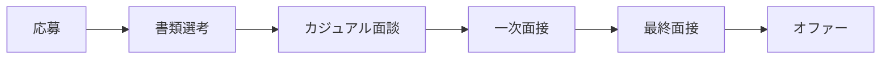

# 選考フロー

## 概要

私たちの選考は以下のステップで進みます。

## 各ステップの詳細

### 1. 応募

<!-- 応募方法、必要書類について -->

### 2. 書類選考

<!-- 所要期間、見ているポイント -->

### 3. カジュアル面談

<!-- 目的、形式、所要時間 -->

### 4. 一次面接

<!-- 面接官、評価ポイント、所要時間 -->

### 5. 最終面接

<!-- 面接官、内容 -->

### 6. オファー

<!-- オファーの流れ、条件提示について -->

---

!!! info "選考期間"
    応募からオファーまで、通常 **2〜4週間** を目安にしています。
